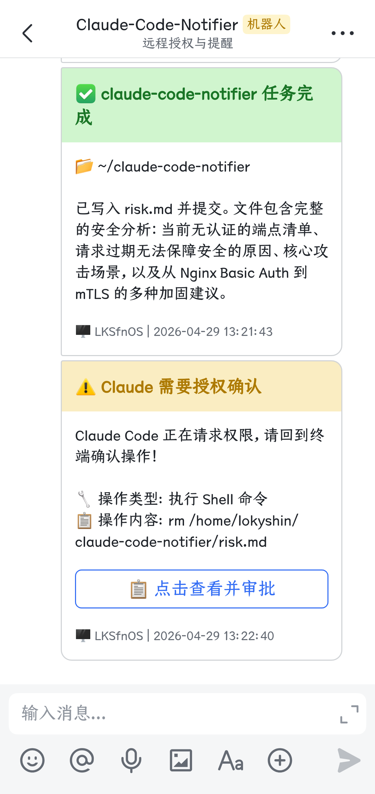
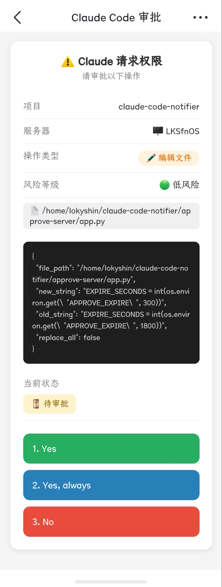
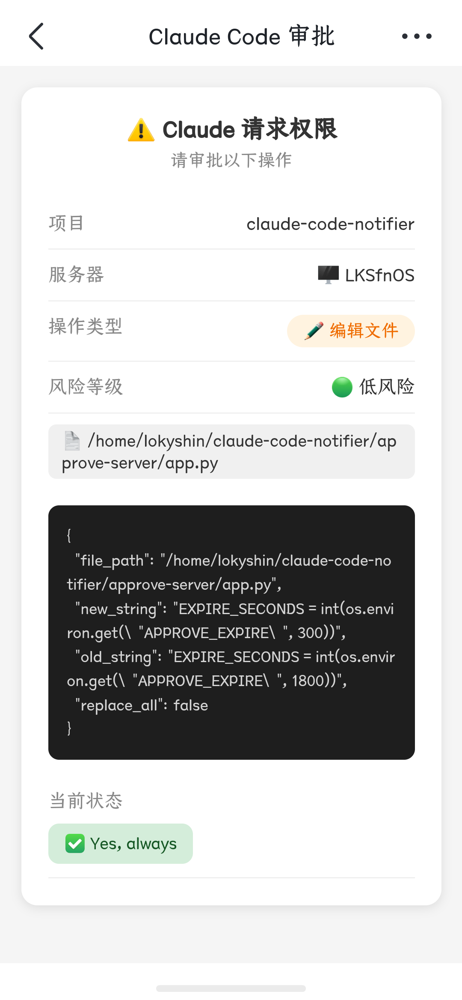
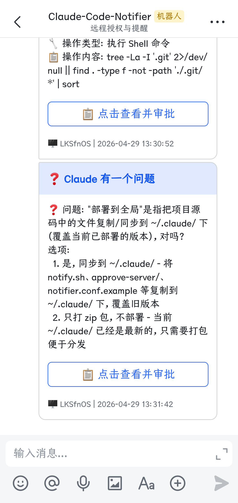
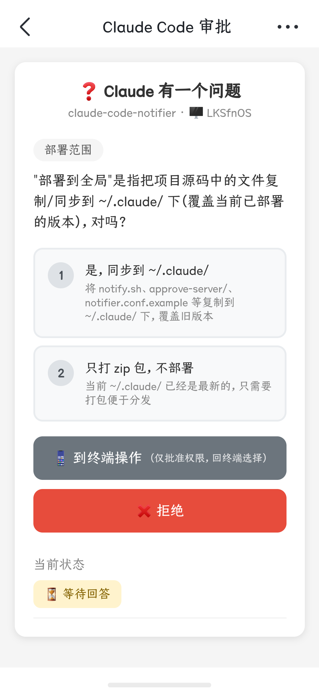
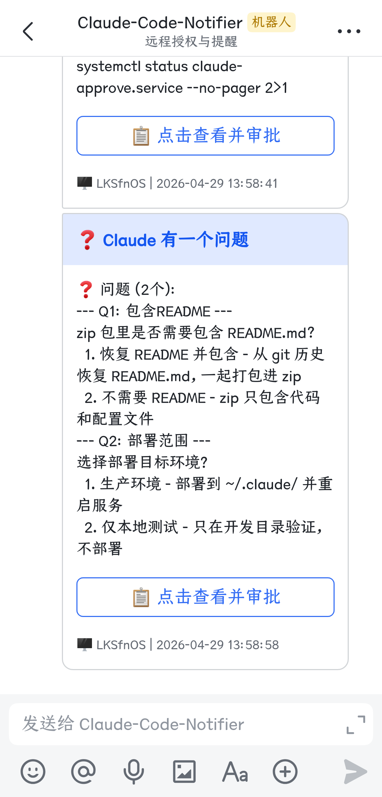
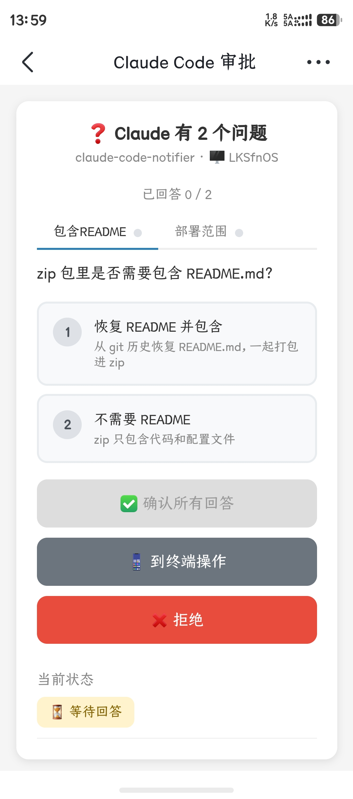
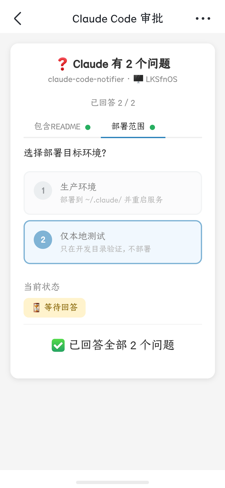
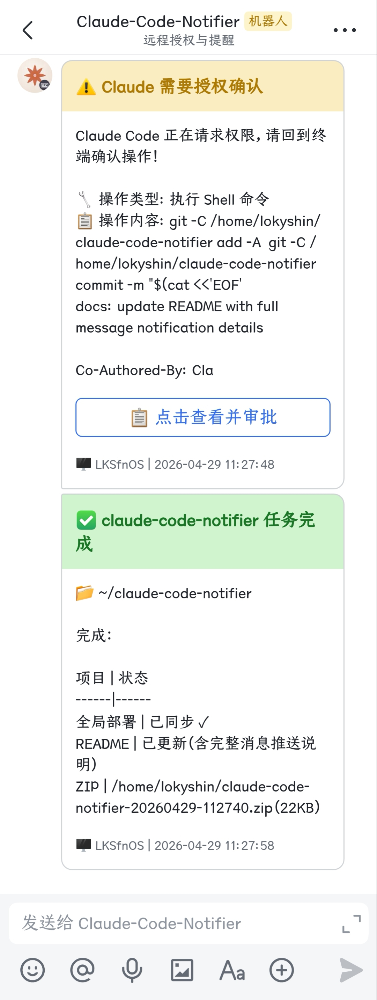

<p align="center">
  
</p>

<h1 align="center">Claude Code Notifier</h1>

<p align="center">
  将 Claude Code 的权限请求、问题选择、任务完成等事件实时推送到手机。<br>
  在手机上直接审批操作、回答问题，按键自动注入终端。<br>
  告别守在电脑前等 Claude 弹框 -- 随时随地掌控 AI 工作流。
</p>

<p align="center">
  <a href="README.md">English Documentation</a>
</p>

---

## 效果展示

> 以飞书为例。同时支持 Server酱（微信）和企业微信。

### 通知卡片

任务完成和权限请求以富文本卡片推送到聊天。

<p align="center">
  
</p>

### 权限请求 → 远程审批

点击卡片打开审批页面，查看操作类型、风险等级、文件路径和完整输入。选择 **Yes** / **Yes, always** / **No**，按键自动注入终端。

<table>
  <tr>
    <td align="center" width="50%">
      <br>
      <sub>审批页面：操作详情 + 审批按钮</sub>
    </td>
    <td align="center" width="50%">
      <br>
      <sub>点击 "Yes, always" 后的状态</sub>
    </td>
  </tr>
</table>

### 单个问题

Claude 向你提问（`AskUserQuestion`）时，手机显示完整问题和选项，选择后自动回填终端。

<table>
  <tr>
    <td align="center" width="50%">
      <br>
      <sub>问题推送到飞书聊天</sub>
    </td>
    <td align="center" width="50%">
      <br>
      <sub>审批页面：选择选项或回终端操作</sub>
    </td>
  </tr>
</table>

### 多问题标签页

多个问题以标签页形式展示，逐个回答后一次性提交。

<table>
  <tr>
    <td align="center" width="33%">
      <br>
      <sub>通知列出所有问题</sub>
    </td>
    <td align="center" width="33%">
      <br>
      <sub>标签视图 -- 正在回答 Q1</sub>
    </td>
    <td align="center" width="34%">
      <br>
      <sub>全部回答完毕，准备提交</sub>
    </td>
  </tr>
</table>

### 任务完成通知

Claude 执行完毕后推送富文本通知：项目名、工作目录、完整任务摘要。多个会话并行时一眼区分哪个完成了、做了什么。

<p align="center">
  
</p>

---

## 功能特性

**权限审批推送** -- 手机收到操作类型、风险等级、命令/文件详情。点击 允许 / 始终允许 / 拒绝，结果自动注入终端。

**问题选择推送** -- 手机显示完整问题和选项，支持单选、多选、多问题标签页。选择后自动回填终端。

**任务完成通知** -- 项目名（取 `cwd` basename）、工作目录、任务摘要（从 `last_assistant_message` 提取，去 markdown，截断 500 字）。

**TUI 选项同步** -- 审批按钮动态匹配终端 TUI（2 或 3 个按钮）。"始终允许"描述从 `permission_suggestions` 解析。

**按键自动注入** -- 三种方式自动检测：
1. **tmux send-keys**（推荐）
2. **TIOCSTI ioctl**（备选）
3. **仅通知模式**（以上不可用时）

**多通道推送** -- 同时启用多个渠道：
- **飞书** -- Webhook（群机器人）或 App（个人消息），支持交互卡片
- **Server酱** -- 推送到个人微信
- **企业微信** -- 群机器人 Webhook

**审批服务** -- Flask 服务器，移动端审批页面 + 仪表盘 + RESTful API，请求自动过期。

---

## 工作原理

```
Claude Code TUI（权限提示 / 提问）
        │
  Hook → notify.sh（读取 stdin JSON）
        │
   ┌────┴────┐
   ▼         ▼
 多通道     approve-server
 推送通知    POST /api/request
   │              │
   ▼              ▼
 手机通知 ──→ 审批页面（移动端 Web UI）
              │
         点击 允许 / 拒绝 / 选择选项
              │
         POST /api/approve 或 /api/answer
              │
         notify.sh 轮询 /api/status
              │
         tmux send-keys → 终端
              │
         Claude Code 继续执行
```

---

## 项目结构

```
claude-code-notifier/
├── notify.sh                     # Hook 入口、上下文解析、推送、轮询、按键注入
├── notifier.conf.example         # 配置文件模板
├── README.md / README_CN.md      # 文档
├── images/                       # Logo 和截图
└── approve-server/
    ├── app.py                    # 后端 API
    ├── templates/approve.html    # 移动端审批页面
    ├── requirements.txt          # Python 依赖
    └── claude-approve.service    # systemd 服务模板
```

---

## 安装部署

### 从 GitHub 克隆

```bash
git clone https://github.com/lokyshin/claude-code-notifier.git
cd claude-code-notifier

cp notify.sh ~/.claude/notify.sh && chmod +x ~/.claude/notify.sh
cp notifier.conf.example ~/.claude/notifier.conf

cp -r approve-server ~/.claude/approve-server
cd ~/.claude/approve-server
python3 -m venv venv && source venv/bin/activate && pip install -r requirements.txt
```

### 使用 zip 迁移包

```bash
unzip claude-code-notifier-*.zip -d /tmp/ccn
cp /tmp/ccn/notify.sh ~/.claude/notify.sh && chmod +x ~/.claude/notify.sh
cp /tmp/ccn/notifier.conf.example ~/.claude/notifier.conf
cp -r /tmp/ccn/approve-server ~/.claude/approve-server
cd ~/.claude/approve-server
python3 -m venv venv && source venv/bin/activate && pip install -r requirements.txt
```

然后编辑 `~/.claude/notifier.conf` 填入你的渠道凭据。

---

## 配置

### 通知渠道

编辑 `~/.claude/notifier.conf`，至少启用一个：

**飞书 App 模式**（推荐）：
```bash
USE_FEISHU=1
FEISHU_MODE="app"
FEISHU_APP_ID="cli_xxxxxxxxxxxxxxxx"
FEISHU_APP_SECRET="xxxxxxxxxxxxxxxxxxxxxxxxxxxxxxxx"
FEISHU_RECEIVE_TYPE="open_id"
FEISHU_RECEIVE_ID="ou_xxxxxxxxxxxxxxxxxxxxxxxxxxxxxxxx"
```

**飞书 Webhook 模式**：
```bash
USE_FEISHU=1
FEISHU_MODE="webhook"
FEISHU_WEBHOOK="https://open.feishu.cn/open-apis/bot/v2/hook/xxxxxxxx-xxxx"
```

**Server酱**（个人微信）：`USE_SERVERCHAN=1` + `SERVERCHAN_KEY="SCTxxx..."`

**企业微信**：`USE_WXWORK=1` + `WXWORK_WEBHOOK="https://qyapi.weixin.qq.com/..."`

### 远程审批

```bash
USE_REMOTE_APPROVE=1
APPROVE_SERVER="https://your-domain.com"
APPROVE_INTERVAL=3
APPROVE_EXPIRE=300
```

> **安全提示**：审批 API 无内置认证，`APPROVE_EXPIRE` 建议 120-300 秒。对外暴露时建议 Nginx 加 Basic Auth 或 mTLS。

### Claude Code Hooks

写入 `~/.claude/settings.json`：

```json
{
  "hooks": {
    "PermissionRequest": [
      {
        "matcher": "",
        "hooks": [{ "type": "command", "command": "~/.claude/notify.sh permission", "timeout": 10 }]
      }
    ],
    "Stop": [
      {
        "matcher": "",
        "hooks": [{ "type": "command", "command": "~/.claude/notify.sh done", "timeout": 10 }]
      }
    ]
  }
}
```

> `PermissionRequest` 同时处理权限请求和 `AskUserQuestion` 事件。

---

## 启动审批服务

**systemd**（推荐）：
```bash
sed -i "s/YOUR_USERNAME/$(whoami)/g" ~/.claude/approve-server/claude-approve.service
sudo cp ~/.claude/approve-server/claude-approve.service /etc/systemd/system/
sudo systemctl daemon-reload && sudo systemctl enable --now claude-approve
```

**手动启动**：
```bash
cd ~/.claude/approve-server && source venv/bin/activate
gunicorn -w 1 --threads 2 -b 0.0.0.0:9120 app:app
```

**Nginx 反向代理**（推荐配 HTTPS）：
```nginx
server {
    listen 443 ssl;
    server_name your-domain.com;
    ssl_certificate /path/to/cert.pem;
    ssl_certificate_key /path/to/key.pem;
    location / {
        proxy_pass http://127.0.0.1:9120;
        proxy_set_header Host $host;
        proxy_set_header X-Real-IP $remote_addr;
        proxy_set_header X-Forwarded-For $proxy_add_x_forwarded_for;
        proxy_set_header X-Forwarded-Proto $scheme;
    }
}
```

---

## API 参考

| 端点 | 方法 | 说明 |
|------|------|------|
| `/` | GET | 仪表盘 |
| `/approve/<id>` | GET | 审批页面（移动端） |
| `/api/request` | POST | 创建请求（notify.sh 调用） |
| `/api/status/<id>` | GET | 查询状态（notify.sh 轮询） |
| `/api/approve/<id>` | POST | 权限审批：`approve` / `always` / `reject` |
| `/api/answer/<id>` | POST | 问题回答 |

---

## 配置参考

| 配置项 | 默认值 | 说明 |
|--------|--------|------|
| `USE_FEISHU` | `0` | 启用飞书 |
| `FEISHU_MODE` | `webhook` | `webhook` 或 `app` |
| `FEISHU_WEBHOOK` | - | Webhook URL |
| `FEISHU_APP_ID` / `APP_SECRET` | - | 应用凭据 |
| `FEISHU_RECEIVE_TYPE` | `chat_id` | `open_id` / `chat_id` / `user_id` |
| `FEISHU_RECEIVE_ID` | - | 接收者 ID |
| `USE_SERVERCHAN` | `0` | 启用 Server酱 |
| `SERVERCHAN_KEY` | - | API Key |
| `USE_WXWORK` | `0` | 启用企业微信 |
| `WXWORK_WEBHOOK` | - | Webhook URL |
| `USE_REMOTE_APPROVE` | `0` | 启用审批服务 |
| `APPROVE_SERVER` | - | 服务地址 |
| `APPROVE_INTERVAL` | `3` | 轮询间隔（秒） |
| `APPROVE_EXPIRE` | `300` | 请求过期 + 轮询超时（秒） |
| `LOG_FILE` | `~/.claude/notifier.log` | 日志路径 |

| 环境变量 | 说明 |
|---------|------|
| `CLAUDE_NOTIFIER_CONFIG` | 配置路径（默认 `~/.claude/notifier.conf`） |
| `CLAUDE_PROJECT_DIR` | 项目目录（Claude Code 自动设置） |
| `APPROVE_HOST` / `APPROVE_PORT` | 服务监听（默认 `127.0.0.1:9120`） |
| `APPROVE_EXPIRE` | 请求过期时间（默认 `300`） |
| `APPROVE_DEBUG` | Flask 调试模式 |

---

## 环境要求

- Python 3.8+ / tmux（推荐）/ Claude Code CLI / curl / Nginx（可选）

## 日志与安全

```bash
tail -f ~/.claude/notifier.log          # notify.sh 日志
sudo journalctl -u claude-approve -f    # 审批服务日志
```

- `chmod 600 ~/.claude/notifier.conf` -- 包含 API 密钥
- 审批服务通过 Nginx + HTTPS 暴露，不要直接暴露 9120 端口
- 请求存在内存中，重启即清空
- Token 缓存权限自动设为 600

## 许可

MIT
